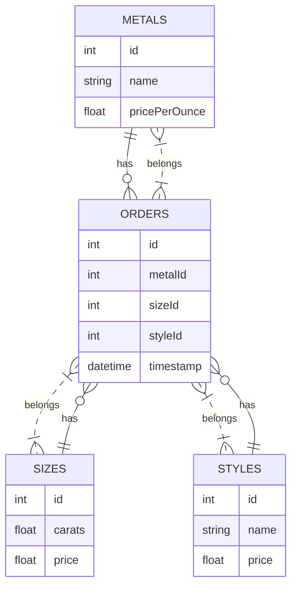

```mermaid
classDiagram
    class Metal {
        - id: int
        - name: string
        - pricePerOunce: float
    }
    class Size {
        - id: int
        - carats: float
        - price: float
    }
    class Style {
        - id: int
        - name: string
        - price: float
    }
    class Order {
        - id: int
        - metalId: int
        - sizeId: int
        - styleId: int
        - timestamp: datetime
    }
    Metal "1" --* "many" Order : has
    Size "1" --* "many" Order : has
    Style "1" --* "many" Order : has
    Order "many" -- "1" Metal : belongs
    Order "many" -- "1" Size : belongs
    Order "many" -- "1" Style : belongs